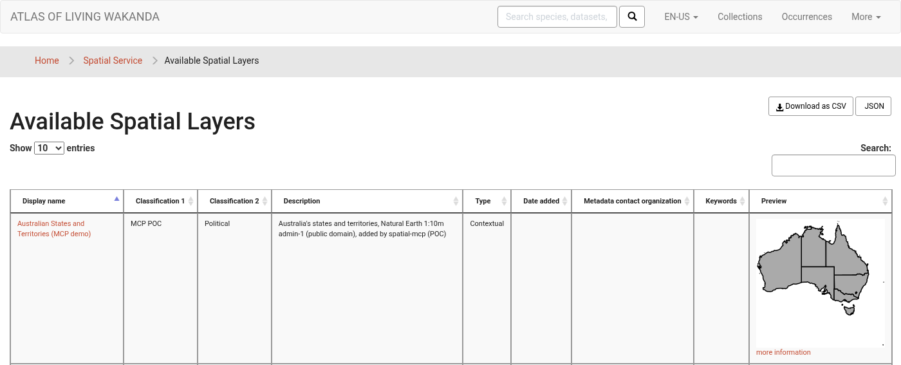
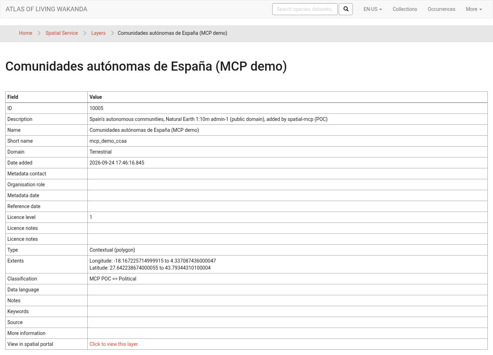
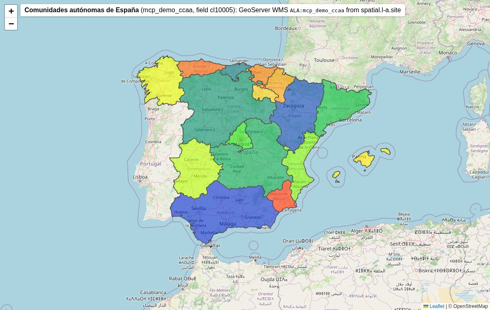

# spatial-mcp

> **Experimental proof of concept.** This is not production software and it is not an ALA
> Try it on a test portal first (for example the LA demo, spatial.l-a.site), never directly on production.

spatial-mcp lets you administer a Living Atlases **Spatial Portal** by talking to an AI assistant (Claude, or any
[MCP](https://modelcontextprotocol.io) client) instead of clicking through the spatial-service admin pages.
It is aimed at the people who run a portal: adding layers, checking them, fixing their metadata, watching the
background tasks.

You ask in plain language, for example *"add this shapefile as a layer of regions"*. The assistant checks
the file, shows you what it is going to do, and only does it after you say yes.

## What you can do with it

**Add a layer** (it follows the Living Atlases wiki page
[Adding Layers](https://github.com/AtlasOfLivingAustralia/documentation/wiki/Adding-Layers), step by step):
- check a zip before uploading it: that it has SHP, SHX, DBF and PRJ; that it is in WGS84; the DBF encoding;
  which column holds the name of each area;
- upload it, create the layer, create the field, wait for the background tasks and reload the intersect configuration;
- check the result the way the wiki's step 8 does: the layer and field are listed, the areas exist, KML and
  intersect work, GeoServer draws it, the admin page opens.

**Look after existing layers**
- list and search layers and fields; see their areas (objects);
- change a layer's display name, description, classification (the tree in the portal), licence, or enable/disable it;
- change a field's name, description, or whether it is searchable in the gazetteer;
- delete a layer, a field or an unused upload;
- compare your layers with another portal (e.g. spatial.ala.org.au) and copy a layer definition from it.

**Background tasks**
- see what is queued, running or failed, and the log of a task;
- cancel or re-run a task;
- run maintenance processes (thumbnails, tabulations…) and the portal's analyses (Area report, AOO/EOO,
  Points to grid…, see ALA's [Spatial Portal tools](https://support.ala.org.au/support/solutions/articles/6000208466-tools)).

**Areas**: create an area from WKT or GeoJSON, like the portal's *Import > Areas*, and delete it.

## Before you start

You need:
1. **Node.js 20 or later** on the computer where the assistant runs.
2. **An admin account** on the portal (the one you use for the spatial admin pages, with the admin role, e.g.
   `ROLE_ADMIN`). You log in with it **in your browser**, on the portal's usual login page: spatial-mcp never sees
   or stores your password. Without an account you can still use the read-only tools (list layers, fields, intersect…).
3. **The portal's login server (OIDC) address and a client id for spatial-mcp.** Ask your portal administrator, or
   register it yourself: see [Registering spatial-mcp in your login server](#registering-spatial-mcp-in-your-login-server).
   Usually the address is `https://auth.<your portal>/cas/oidc` (CAS) or `https://<keycloak>/realms/<realm>` (Keycloak).

## Install

```bash
git clone https://github.com/living-atlases/spatial-mcp
cd spatial-mcp
npm ci
npm run build
```

This leaves the server in `dist/stdio.js`. Below, replace `/path/to/spatial-mcp` with the full path of the folder
you cloned (`pwd` shows it). Use the full path: the assistant starts the server from another folder.

Add it to Claude Code (one line; adapt the addresses). There is no password or secret in it:

```bash
claude mcp add spatial -e SPATIAL_OIDC_ISSUER=https://auth.l-a.site/cas/oidc -e SPATIAL_OIDC_CLIENT_ID=spatial-mcp -e SPATIAL_ALLOWED_DIRS=/home/you/layers -- node /path/to/spatial-mcp/dist/stdio.js --spatial https://spatial.l-a.site/ws
```

For Claude Desktop, add the same to `claude_desktop_config.json`:

```json
{
  "mcpServers": {
    "spatial": {
      "command": "node",
      "args": ["/path/to/spatial-mcp/dist/stdio.js", "--spatial", "https://spatial.l-a.site/ws"],
      "env": {
        "SPATIAL_OIDC_ISSUER": "https://auth.l-a.site/cas/oidc",
        "SPATIAL_OIDC_CLIENT_ID": "spatial-mcp",
        "SPATIAL_ALLOWED_DIRS": "/home/you/layers"
      }
    }
  }
}
```

| Setting | What it is |
|---|---|
| `--spatial` (or `SPATIAL_URL`) | Your spatial-service address, ending in `/ws` |
| `SPATIAL_OIDC_ISSUER`, `SPATIAL_OIDC_CLIENT_ID` | Your portal's login server and the client id registered for spatial-mcp |
| `SPATIAL_ALLOWED_DIRS` | Folders the assistant may upload zips from (recommended) |
| `SPATIAL_READONLY=1` | Look, don't touch: every change is refused (previews still work) |
| `SPATIAL_USERNAME` | Only for spatial-service 3.1.0 admin pages, see [below](#admin-pages-on-spatial-service-310) |

Less common: `SPATIAL_OIDC_SCOPE` (default `openid profile email roles ala offline_access`), `SPATIAL_OIDC_FLOW=device`
(log in from another device with a code, for a machine without a browser, if your login server supports it),
`SPATIAL_OIDC_REDIRECT_PORT` / `SPATIAL_OIDC_REDIRECT_HOST` (login servers that need an exact redirect address, e.g.
Cognito), `SPATIAL_TOKEN_STORE=file` (do not use the OS keyring).

Restart Claude Desktop after editing the file (in Claude Code, `claude mcp list` shows whether it connected).
Then ask *"Is the spatial MCP working?"*: it answers with the portal version, the number of layers, how it logs in,
who is logged in and whether your admin access works.

### Logging in

The first time you ask for something that needs the admin account, your browser opens on the portal's login page.
Log in as usual and go back to the assistant (if the browser did not open, the assistant gives you the link). You can
also say *"log in to the portal"*, or log in from a terminal before starting the assistant:

```bash
SPATIAL_OIDC_ISSUER=https://auth.l-a.site/cas/oidc SPATIAL_OIDC_CLIENT_ID=spatial-mcp node /path/to/spatial-mcp/dist/stdio.js login
```

You stay logged in: spatial-mcp keeps a *refresh token* (not your password) in your system's keyring (GNOME Keyring /
KWallet, macOS Keychain, Windows Credential Manager), or, where there is none, in a file only you can read under
`~/.config/spatial-mcp/`. When it expires or is revoked, the browser login opens again. `… dist/stdio.js logout`
(or *"log out of the portal"*) forgets it.

### Admin pages on spatial-service 3.1.0

spatial-service 3.1.0 accepts the OIDC login for its API, tasks, areas and the intersect reload, but its admin
pages (adding and editing layers, uploads, the task list) only accept a browser session. Until spatial-service
accepts the login there too (see [DEVELOPMENT.md](DEVELOPMENT.md#findings-about-spatial-service-310), finding 1),
spatial-mcp can log in to those pages for you, with your password kept in the keyring instead of the configuration:

1. Add `-e SPATIAL_USERNAME=you@example.org` to the `claude mcp add` line (or `"SPATIAL_USERNAME"` to `env`).
2. Store the password once, in a terminal (it is typed without echo, and never written to the MCP configuration):

   ```bash
   SPATIAL_USERNAME=you@example.org node /path/to/spatial-mcp/dist/stdio.js set-password --spatial https://spatial.l-a.site/ws
   ```

   `forget-password` removes it. *"Is the spatial MCP working?"* tells you whether your portal needs this
   (`adminPagesAcceptToken: false`).

`SPATIAL_PASSWORD` (the password in plain text in the configuration) still works but is deprecated.

### Registering spatial-mcp in your login server

spatial-mcp is a *public* OIDC client: it has no secret, uses the Authorization Code flow with PKCE (S256), and
receives the login on a local address, `http://127.0.0.1:<random port>/callback` (RFC 8252). Register it once per
login server, and give its client id to your admins.

**CAS 6/7 (ALA CAS)**: add a service like this one (JSON service registry; ala-install's `oidc-keys-add` role writes
the same fields to MongoDB):

```json
{
  "@class": "org.apereo.cas.services.OidcRegisteredService",
  "id": 1001,
  "name": "spatial-mcp",
  "clientId": "spatial-mcp",
  "clientSecret": "",
  "serviceId": "^http://127\\.0\\.0\\.1:\\d+/callback$",
  "tokenEndpointAuthenticationMethod": "none",
  "supportedGrantTypes": ["java.util.HashSet", ["authorization_code", "refresh_token"]],
  "supportedResponseTypes": ["java.util.HashSet", ["code"]],
  "scopes": ["java.util.HashSet", ["openid", "profile", "email", "roles", "ala", "offline_access"]],
  "bypassApprovalPrompt": true,
  "generateRefreshToken": true,
  "jwtAccessToken": true
}
```

`jwtAccessToken` matters: spatial-service only accepts access tokens that are JWTs.

**Keycloak**: create a client `spatial-mcp` with *Client authentication* off, *Standard flow* on, *PKCE method*
`S256` (Advanced), and valid redirect URI `http://127.0.0.1/*` (Keycloak accepts any port on a loopback address;
if your version does not, set `SPATIAL_OIDC_REDIRECT_PORT` and register that exact port). Optional: *OAuth 2.0
Device Authorization Grant* on, for `SPATIAL_OIDC_FLOW=device`. Add a *User Realm Role* mapper with token claim name
`role` (multivalued, in the access token), so spatial-service sees the admin role. spatial-service also requires a
`client_id` claim by default: if your access tokens lack it (they carry `azp`), add a *Hardcoded claim* mapper
`client_id` = `spatial-mcp`, or drop it from `security.jwt.requiredClaims`.

**Amazon Cognito**: an app client *without* a client secret, *Authorization code grant*, scopes `openid profile email`,
callback URL `http://localhost:8765/callback` (Cognito only allows `http` for `localhost`, with an exact port), then
set `SPATIAL_OIDC_REDIRECT_HOST=localhost`, `SPATIAL_OIDC_REDIRECT_PORT=8765` and `SPATIAL_OIDC_SCOPE=openid profile email`.
The issuer is `https://cognito-idp.<region>.amazonaws.com/<user pool id>`.

**spatial-service** must accept JWTs (`security.jwt.enabled: true`, with `security.jwt.discoveryUri` pointing to the
same login server) and read the admin role from the claim your login server uses (`security.jwt.roleClaims`:
`role` by default, `cognito:groups` for Cognito). By default it also requires the claims `sub`, `iat`, `exp`,
`client_id`, `jti` and `iss` in the access token (`security.jwt.requiredClaims`). It does not check the audience
unless `security.jwt.acceptedAudiences` is set: if it is, add spatial-mcp's client id to it.

To update it later: `git pull && npm ci && npm run build` in the same folder, then restart the assistant.

## Adding a layer, step by step

1. **Prepare the zip.** One layer per zip: a shapefile (SHP, SHX, DBF, PRJ) or a grid (HDR, BIL, PRJ), in WGS84,
   with the DBF in ISO-8859-1. A GeoTIFF has to be converted first (`gdal_translate -of EHdr …`).
2. **Ask the assistant to check it:** *"Check ~/layers/ibra7_regions.zip"*. It tells you what is wrong, if anything,
   and which column looks like the name of each area.
3. **Ask for the layer:** *"Add ~/layers/ibra7_regions.zip as a contextual layer called `ibra7_regions`, shown as
   'IBRA 7 Regions', under Biodiversity > Region, with the REG_NAME_7 column as the name of each area."*
   It shows you a **preview** of exactly what it will fill in on the admin form. Nothing has been changed yet.
4. **Say yes.** It uploads, creates the layer and the field, and waits for the tasks. Small layers finish in a
   few minutes; for big ones it tells you it is still working and checks back when you ask.
5. **Check it:** *"Check the new layer with a point in Canberra."* It runs the wiki's checks and tells you which
   ones pass.

You can also do it one step at a time (*"just upload it"*, *"now create the field"*), exactly like in the admin pages.

On spatial-service 3.1.0 a new layer answers point queries (*intersect*) only after spatial-service is restarted;
the check in step 5 tells you so. Everything else (areas, search, map) works straight away.

### What the result looks like

A layer added this way on the LA demo portal: Australia's states and territories, from a Natural Earth shapefile
([`test/fixtures/mcp_demo_aus_states.zip`](test/fixtures/mcp_demo_aus_states.zip)). It shows up in the portal like
any layer added by hand, and after the restart mentioned above a point query answers with the state
(`/ws/intersect/cl10004/-23.70/133.88` → *Northern Territory*):







## More things to ask

- *"Which layers do we have under Area Management?"*
- *"Move the layer `ibra7_regions` to Biodiversity > Region and set the licence to CC BY."*
- *"Hide the layer `test_old`"* (disable it) or *"delete the layer `mcp_poc_…` and its upload."*
- *"What tasks failed this week? Show me the log of the last FieldCreation."*
- *"Re-run the thumbnails."*
- *"Which layers does spatial.ala.org.au have that we don't?"*
- *"Create an area from this GeoJSON and run an Area report on it."*

## Is it safe?

- **Nothing changes without your OK.** Every change is first shown as a preview; the assistant has to ask you
  and repeat the call with an explicit confirmation. Deleting and cancelling always ask.
- **It cannot do what the admin pages cannot do.** It fills in the same forms you would, with the same limits
  (lengths, allowed values, fields that cannot change once a layer exists). If a new spatial-service version
  changes a form in a way it does not understand, it stops instead of guessing.
- **It only uploads `.zip` files**, never from hidden folders, and only from `SPATIAL_ALLOWED_DIRS` if you set it.
- **You log in in your browser**: spatial-mcp never sees your password (except the optional 3.1.0 fallback, kept in
  your keyring). Your tokens are never shown to the assistant, not even in error messages, nor written to its configuration.
- **`SPATIAL_READONLY=1`** turns it into a look-only tool.

It is still a proof of concept: use a test portal, and keep an eye on what it does.

## When something goes wrong

| Message | What to do |
|---|---|
| *Not logged in to the portal yet* | Finish the login in the browser window it opened (or open the link it gives), then ask again. |
| *needs a logged-in user with the admin role* (401/403) | Check that your account has the admin role in the portal, and that spatial-service accepts your login server's tokens (see *Registering spatial-mcp*). |
| *only accepts a web-session login on its admin pages* | spatial-service 3.1.0: see [Admin pages on spatial-service 3.1.0](#admin-pages-on-spatial-service-310). |
| *no password stored for …* | Run `set-password` (same section). |
| *login … was refused* | The stored admin password is wrong: run `set-password` again. |
| *OIDC discovery failed* | Check `SPATIAL_OIDC_ISSUER`: `<issuer>/.well-known/openid-configuration` must open in the browser. |
| *login did not reach spatial-service* | Your portal's login page is not the usual CAS one (e.g. a different identity provider). Please open an issue. |
| *not in WGS84* | Reproject the layer to EPSG:4326 (QGIS *Export > Save as*, or `ogr2ogr -t_srs EPSG:4326`). |
| *"sname" is needed* | Tell it which DBF column holds the name of each area (the check in step 2 suggests one). |
| *Refused by the form contract* | What you asked for doesn't fit the admin form (too long, not an allowed value, or it can't be changed). Change it, or do it by hand. |
| *LayerCreation/FieldCreation failed* | Ask for the task log. The usual causes are the projection, the encoding, or GeoServer. |
| *is not a field of the form* | The spatial-service version changed its admin form. Please open an issue. |

## Using it without installing anything (for portal operators)

The same server can run next to spatial-service, so admins connect to it by URL instead of installing it. For
now that mode only covers reads, tasks and areas on spatial-service 3.1.0: its admin pages need a browser session,
which the remote mode does not have. See [DEVELOPMENT.md](DEVELOPMENT.md#remote-http-transport).

## More

- [DEVELOPMENT.md](DEVELOPMENT.md): how it works, design decisions, tests and CI, what spatial-service would need.
- License: [MPL-2.0](LICENSE) (compatible with spatial-service's MPL-1.1; see DEVELOPMENT.md).
- Sibling POC for the GBIF IPT: [ipt-mcp](https://github.com/vjrj/ipt-mcp).
